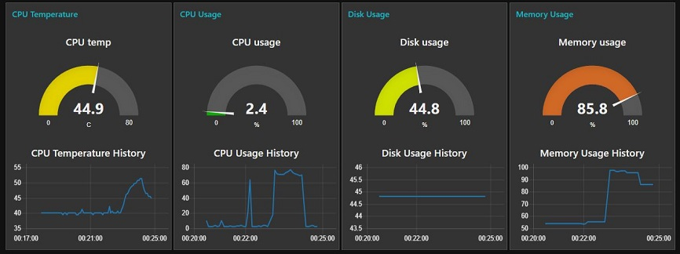
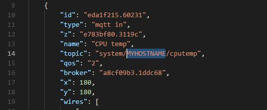

# Raspberry Pi Diagnostics - MQTT

We present a [Raspberry Valley](https://raspberry-valley.azurewebsites.net) approach to monitoring Pi diagnostics via MQTT.

Scenario: your killer app is not behaving as it should. Maybe the CPU is overloaded, maybe the Pi is overheating, maybe you have consumed all memory. Enter the diagnostics tool: you can monitor remotely, or in a console window how your app is consuming resources.

This is a Python script, which collects system data and sends them to MQTT diagnostics topics, and to the console. If you use our [Raspberry Pi IoT Device](https://raspberry-valley.azurewebsites.net/IoT-Raspberry-Pi-Device/), then simply clone the script and run it. However, you don't have to have the image available: in such a case, just check the pre-requisites page and install only the required components.

## Diagnostics values sent

* CPU Temperature \[C\]
* CPU Load Percentage \[%\]
* Disk Usage Percentage \[%\]
* Memory Usage Percentage \[%\]

All values are sent to topics using the pattern below. You can change the pattern in **config.py**

```bash
system/<hostname>/<measurementname>
```

Below is an example where we monitor a camera solution for debugging, using a remote MQTT server (with Node-RED and Node-RED Dashboard) for impact of configuration settings.



**Note**: you can get quickly started by modifying our dashboard: just import the file content from **mqtt-diag-pi-ui.json** into your Node-RED dashboard and get hacking to your liking. Please make sure that you first replace all occurences of "MYHOSTNAME" with the hostname of the PI you are monitoring



## Pre-requisites

Before cloning the project, install the following components:

* Install Git

```bash
sudo apt-get install git
```

* We Assume you have **pip** installed on your device. If not, open up the terminal and type:

```bash
sudo apt-get install python-pip
```

* Either run the [Raspberry Pi IoT Device](https://raspberry-valley.azurewebsites.net/IoT-Raspberry-Pi-Device/), or install MQTT only. In the latter case, you will need to subscribe to the topics described below, or make use of the console monitoring only. For installation of MQTT (Mosquitto), you can find our guide [here](https://raspberry-valley.azurewebsites.net/Mosquitto/). Follow the full guide, you need the Paho libraries as well. Or simply follow the commands below:

```bash
sudo apt-get install mosquitto
sudo apt-get install mosquitto-clients
sudo pip install paho-mqtt
```

* Install [psutil](https://psutil.readthedocs.io/en/latest/)

```bash
pip install psutil
```

## Running Diagnostics

You have several options on how to run the diagnostics.

* First, clone the repository to your Pi and navigate to the directory
* Now run the Python script. We like to run it directly, so you might want to do the following:

```bash
chmod +x mqtt-diag-pi.py
./mqtt-diag-pi.py
```

This basically sets the script as an executable and you can run it standalone. You can of course always ignore the above, and use the standard approach:

```bash
python mqtt-diag-pi.py
```

* With the default settings, your local MQTT server now receives updates every 5 seconds, and also your console log gives a summary of the measurements
* Time to get creative and use NODE-RED dashobard itself, or send the data to another machine running MQTT